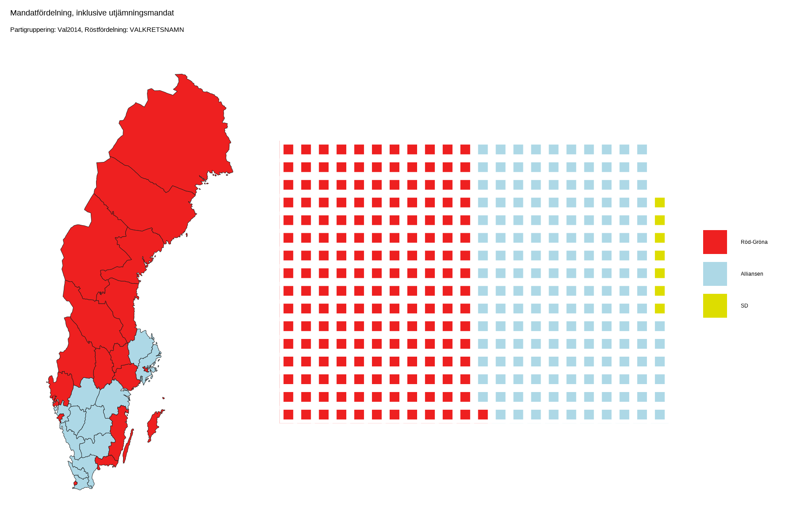
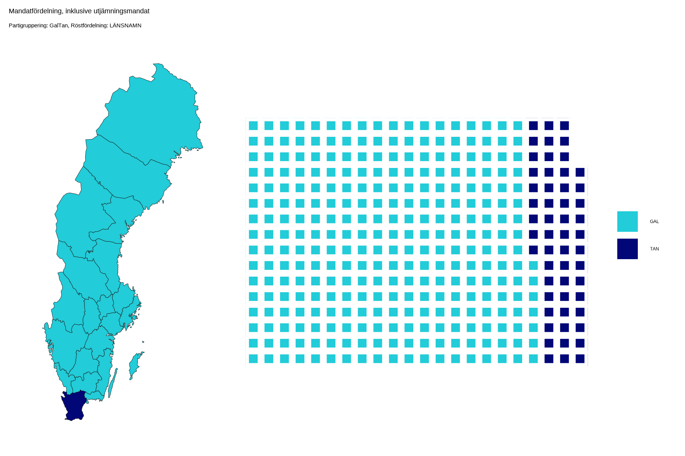
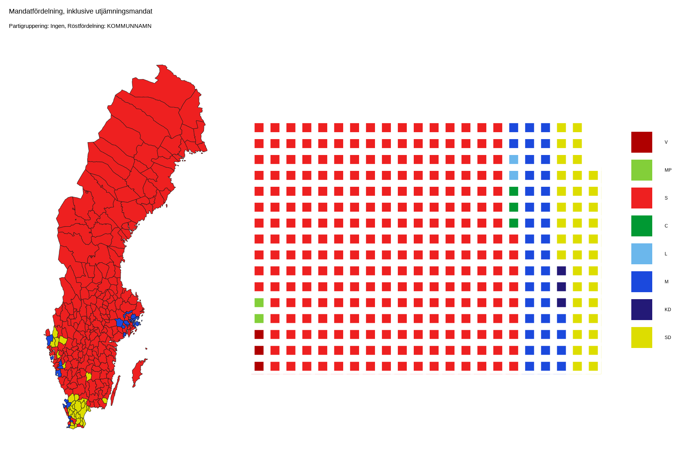

# electoral_sweden
Hur skulle det se ut om Sveriges riksdagsplatser delades ut med en winner-takes-it-all princip? Om alla mandat i en valkrets, län eller kommun tillföll det största partiet. Vi hade antagligen inte haft åtta partier som vi har idag, utan färre och större sammanslutningar, kanske motsvarande Alliansen och de Röd-Gröna från valet 2014 eller grupperat enligt Gal-Tan-skalan.

En interaktiv version finns på [shinyapps.io](https://napoleongl.shinyapps.io/electoral_sweden/)

### Mandatfördelning
Utöver de 310 mandat som fördelas olika geografiska områden efter befolkningsstorlek finns också 39 utjämningsmandat som fördelas med jämkade uddatals-metoden baserad på det totala antalet röster i hela landet.

### Partigrupperingar
Utöver att använda partirösterna som de faktiskt var används också några andra grupperingar. Dels som valet 2014 där S, MP och V utgjorde de Röd-Gröna och ställdes mot Alliansen som bestod av M, KD, L och C. Vid sidan om detta fanns SD som vågmästare. Vidare kan man gruppera enligt Gal-Tan-skalan där M, KD och SD utgör Tan-gruppen, och övriga partier utgör Gal-gruppen. 

## Mandat fördelade på dagens valkretsar
Här används den mandatfördelning som valmyndigheten använde i valet 2018.

### Partier grupperade enligt valet 2014

## Mandat fördelade efter befolkning i län
Alla län tilldelas ett mandat och resterande 289 fasta mandat fördelas med jämkade uddatals-metoden som också används när mandat fördelas mellan valkretsar av valmyndigheten.

### Partier grupperade enligt GalTan-skalan

## Mandat fördelade efter befolkning i kommuner
Alla kommuner får minst ett mandat. Övriga 20 fasta mandat fördelas med jämkade uddatals-metoden precis som i falet med länsfördelade mandat.

### Ingen gruppering av partier
